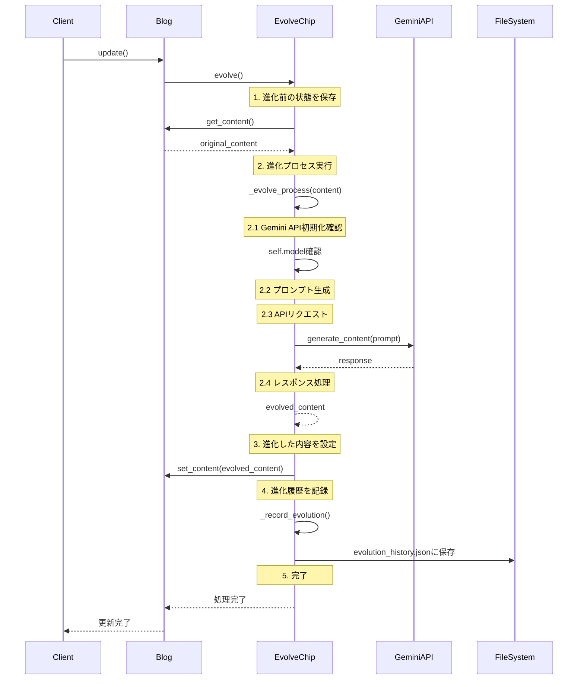

# AIチップブログ

## 概要
AIチップブログは、Gemini APIを活用してブログ記事を自動的に改善・進化させるアプリケーションです。
ユーザーが指定した方向性に基づいて、AIが記事の内容を最適化します。

## 特徴
- シンプルなGUIインターフェース
- AIによる記事の自動改善
- タグ管理機能
- 進化履歴の自動記録
- エラーハンドリングとログ出力

## 技術スタック
- Python 3.8+
- Google Gemini API
- tkinter (GUI)
- loguru (ログ出力)

## プロジェクト構造
```
.
├── evolve_chip.py      # AIチップの基本実装
├── blog.py            # ブログクラスの実装
├── main.py            # GUIアプリケーション
├── README.md          # このファイル
├── requirements.txt   # 依存パッケージ
└── .gitignore        # Git除外設定
```

## セットアップ
1. 環境変数の設定
```bash
export GEMINI_API_KEY='your-api-key'
```

2. 依存パッケージのインストール
```bash
pip install -r requirements.txt
```

## 使用方法

### GUIアプリケーションの起動
```bash
python main.py
```

### 主な機能
1. 記事の編集
   - タイトルの編集
   - 本文の編集
   - タグの追加・管理

2. AIによる進化
   - 「進化」ボタンをクリック
   - 進化の方向性をコメントとして入力
   - 自動的に記事が改善

3. 記事の管理
   - 保存機能
   - 公開機能
   - 進化履歴の記録

## アーキテクチャ

### シーケンス図


## クラス構成

### EvolveChip
AIチップの基本クラス。進化プロセスを管理します。

主要メソッド：
- `evolve()`: 進化プロセスの実行
- `_evolve_process()`: Gemini APIを使用した進化処理
- `_record_evolution()`: 進化履歴の記録

### Blog
ブログ記事を管理するクラス。AIチップを埋め込むことができます。

主要メソッド：
- `embed_chip()`: AIチップの埋め込み
- `update()`: 進化の実行
- `get_content()`: コンテンツの取得
- `set_content()`: コンテンツの設定
- `publish()`: 記事の公開
- `add_tag()`: タグの追加
- `remove_tag()`: タグの削除

### BlogApp
GUIアプリケーションを管理するクラス。

主要メソッド：
- `setup_ui()`: UIの初期化
- `evolve()`: 進化の実行
- `publish()`: 記事の公開
- `save()`: 記事の保存
- `update_content()`: コンテンツの更新

## 注意事項
- Gemini APIキーが必要です
- インターネット接続が必要です
- 進化中は他の操作が無効化されます

## ライセンス
MIT License
